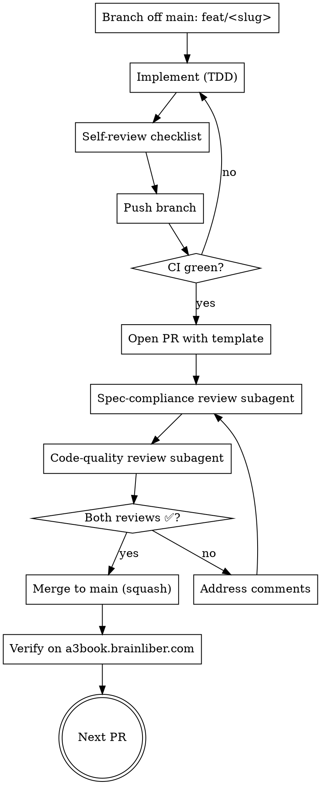

# AgentBook Tier 1–3 Features — PR-Series Implementation Plan

> **For agentic workers:** REQUIRED SUB-SKILL: Use superpowers:subagent-driven-development to implement each PR. One PR per task. Reviewer subagent reviews each PR before merge; next PR does not start until prior PR is merged.

**Goal:** Land all 20 ranked features (Tier 1 + Tier 2 + Tier 3) plus the reliability batch, each as an independently reviewable PR, in priority order. After this series ships, the AgentBook bot is a production-grade accounting assistant for the Maya / Alex / Jordan personas, not a demo.

**Architecture:** Each PR adds capability across one or more of: (a) Telegram bot (`apps/web-next/src/app/api/v1/agentbook/telegram/webhook/route.ts` + `apps/web-next/src/lib/agentbook-bot-agent.ts`), (b) one of the four plugin APIs (agentbook-core / -expense / -invoice / -tax under `apps/web-next/src/app/api/v1/`), (c) the web dashboard (the `(dashboard)/[...slug]/page.tsx` catch-all dispatches to plugin frontends in `plugins/<name>/frontend/`), and (d) Prisma models (`packages/database/prisma/schema.prisma`).

**Tech Stack:** Next.js 14 App Router, Prisma + Neon, grammy (Telegram SDK), Gemini API for LLM tasks, Plaid SDK, Vercel Functions + cron jobs, Vercel Blob for receipt persistence, AbUserMemory for conversational state.

**Source decisions captured during ranking:** see CLAUDE.md and the conversation thread that produced the 20-feature ranking (top-5 first because they each have a hard product-market fit signal in the freelancer persona; tier 2 raises the floor on reliability; tier 3 is convenience polish).

---

## PR cycle (applies to every PR below)

Every PR follows the same gate. Do **not** open the next PR's branch until the prior PR is merged.



### Self-review checklist (every PR)

- [ ] All new endpoints return `{ success, data }` envelope (matches existing convention)
- [ ] All bot replies follow the friendly-accountant tone (e.g. "✅ On the books — Shell $45.23 → Fuel.")
- [ ] Tax-line + ITC notes appear when relevant (per `buildTaxNote` in `webhook/route.ts`)
- [ ] Confirmation gate: bot does NOT silently book without category for ambiguous cases
- [ ] No new code paths bypass the agent-brain pipeline (`runAgentLoop`)
- [ ] Telegram callback_data ≤ 64 bytes (use AbUserMemory keys for state)
- [ ] DB writes use `tenantId` consistently — never default
- [ ] Idempotent against retry (Telegram + Vercel cron both retry)
- [ ] No PII in logs
- [ ] Tests: unit (vitest) for pure logic, e2e (Playwright in `tests/e2e/`) for the user-visible flow
- [ ] Manual smoke on a3book.brainliber.com after merge

### PR template (paste into every description)

```markdown
## Goal
<1 sentence>

## Bot UX
- Trigger: <user message>
- Response: <example>
- Buttons: <list>

## Web UI
- Pages touched: <paths>
- New components: <list>
- Mobile-tested at 375×812: yes/no

## Acceptance criteria
- [ ] <criterion 1>
- [ ] <criterion 2>

## Out of scope
<list>

## Tests
- Unit: <files>
- E2E: <files>

## Rollout
Behind `<feature_flag>` for 24h on Maya's tenant before broad enable, OR
default-on with feature toggle in AbTenantConfig.

## Reviewers
@<reviewer>
```

### Merge gate

Each PR merges only when both review subagents return ✅. The reviewer subagent prompts live at:
- `~/.claude/plugins/cache/claude-plugins-official/superpowers/5.0.7/skills/subagent-driven-development/spec-reviewer-prompt.md`
- `~/.claude/plugins/cache/claude-plugins-official/superpowers/5.0.7/skills/subagent-driven-development/code-quality-reviewer-prompt.md`

---

## Sequencing overview

```
Tier 1 (high-impact, user-facing wins) ────► Tier 2 (reliability + workflow depth) ────► Tier 3 (polish) ────► Reliability batch
PR1 invoice-from-chat                          PR6 recurring-invoice setup                    PR13 multi-currency           PR21 idempotency keys
PR2 time-tracking → invoice                    PR7 estimate → invoice                         PR14 per-diem                 PR22 /status command
PR3 Plaid bank + match (foundation)            PR8 budget + spending caps                     PR15 home-office quarterly    PR23 webhook backoff
PR4 mileage tracker                            PR9 daily reconciliation diff                  PR16 receipt-expiry warnings  PR24 daily backup
PR5 year-end tax package                       PR10 audit trail                               PR17 saved searches           PR25 rate limits
                                               PR11 CPA collaboration                         PR18 multi-receipt batch      PR26 soft-delete
                                               PR12 smart deduction discovery                 PR19 voice transcript cache
                                                                                              PR20 catch-me-up command
```

**Dependencies:**
- PR2 (time → invoice) needs PR1's invoice-from-chat endpoint flow.
- PR3 (Plaid match) is a pure backend foundation; PR9 (reconciliation diff) and PR12 (deduction discovery) consume its output.
- PR5 (year-end tax package) reads from everything above; sequence it last in Tier 1 so the data shapes are stable.
- PR10 (audit trail) wraps the existing event bus; downstream PRs (CPA collab, soft-delete, status command) all read from it.
- The reliability batch can start in parallel with Tier 3 once the team has bandwidth — they're independent.

**Estimated effort** (rough, single engineer days):
- Tier 1 average: 3–4 days/PR (heavier — 5 days for PR3 Plaid)
- Tier 2 average: 2 days/PR
- Tier 3 average: 1 day/PR
- Reliability batch: 0.5–1 day each
- Total: ~50 engineer-days; 8 weeks at one PR per 2 days

---

## Tier 1 — Top 5 (highest leverage)

### PR 1 — Invoice from Telegram chat

**Goal:** Maya types "invoice Acme $5K for July consulting" in Telegram and gets a draft + send/edit buttons. No web context-switch.

**Files:**
- Modify: `apps/web-next/src/lib/agentbook-bot-agent.ts` — extend `IntentName` with `create_invoice_from_chat`; add planner step `gather_invoice_fields` for missing data (client, amount, line items)
- Modify: `apps/web-next/src/app/api/v1/agentbook/telegram/webhook/route.ts` — render the draft preview with [✏️ Edit] [📨 Send now] [❌ Cancel] inline buttons; handle each callback
- Modify: `apps/web-next/src/app/api/v1/agentbook-invoice/[...slug]/route.ts` — POST `/invoices/draft-from-text` accepts the parsed fields and returns the draft
- Create: `apps/web-next/src/lib/agentbook-invoice-parser.ts` — Gemini-powered parser that extracts {clientName, amountCents, description, dueDate} from natural language
- Modify: `tests/e2e/agent-invoice.spec.ts` — three e2e scenarios

**Bot UX:**
- Trigger: "invoice Acme $5K for July consulting"
- If client is unambiguous: shows draft summary with "📒 Draft ready — INV-2026-008. Net-30, due Aug 14. Send it?" + buttons
- If client ambiguous (e.g. two clients named "Acme"): "Which Acme — Acme Corp or Acme Holdings?" with picker buttons
- After [📨 Send now]: "✅ Sent to billing@acme.test. I'll ping you when they pay."

**Web UI:**
- The draft is a real `AbInvoice` with `status='draft'` — already rendered by the existing invoices page; no new UI required for this PR.
- Add a small "via Telegram" badge on invoice detail when `source='telegram'`.

**Acceptance criteria:**
- "invoice Acme $5K consulting" → draft created with correct client, amount, single-line description
- Multi-line ("Acme: $5K consulting, $1K hosting") → 2 line items
- Ambiguous client → clarify dialog (no draft created until user picks)
- [📨 Send now] flips status to `sent`, posts journal entry, returns success message with PDF link
- Invoice appears on web at `/agentbook/invoices`

---

### PR 2 — Time tracking → invoice generation

**Goal:** Maya can `/timer start TechCorp` from Telegram, log hours over the week, and `invoice TechCorp from timer` to generate a multi-line invoice from accumulated time entries.

**Depends on:** PR 1 (invoice-from-chat parser + draft flow).

**Files:**
- Modify: `packages/database/prisma/schema.prisma` — add `AbTimeEntry { id, tenantId, clientId, description, startedAt, stoppedAt, durationMinutes, ratePerHourCents, billed: bool, invoiceLineId? }` (already partially exists — verify and extend)
- Modify: `apps/web-next/src/lib/agentbook-bot-agent.ts` — add intents `start_timer`, `stop_timer`, `invoice_from_timer`
- Modify: `apps/web-next/src/app/api/v1/agentbook-invoice/[...slug]/route.ts` — POST `/timer/start`, POST `/timer/stop`, POST `/invoices/from-time-entries`
- Modify: `plugins/agentbook-invoice/frontend/src/pages/Timer.tsx` — visible web timer, list unbilled entries, "Generate invoice from selected" CTA
- Create: `apps/web-next/src/lib/agentbook-time-aggregator.ts` — groups time entries by client + day for invoice line generation

**Bot UX:**
- "/timer start TechCorp planning" → "⏱ Timer started for TechCorp. Type /timer stop when done."
- "/timer stop" → "⏹ Stopped — 1h 23min logged for TechCorp. Total this week: 6h 12min."
- "invoice TechCorp from timer this week" → "📒 12 entries × $150/hr = $930. Draft ready — send?"
- Confirmation gate before booking.

**Web UI:**
- New `/agentbook/timer` page: live timer button, today's entries, unbilled-by-client view
- "Generate invoice" multi-select on unbilled entries

**Acceptance:**
- Multi-day timer works (no clock skew between Telegram and web)
- Stopping a timer that hasn't been started → friendly error
- Invoice from timer marks all consumed entries `billed=true`
- Web invoice detail shows time-entry breakdown when source='time-entries'

---

### PR 3 — Plaid bank connection + payment matching

**Goal:** Maya links her bank in 60 seconds and incoming transactions auto-match to outstanding invoices and existing expenses, eliminating manual reconciliation.

**Files:**
- Modify: `packages/database/prisma/schema.prisma` — extend `AbBankConnection` (add `plaidItemId`, `accessToken` (encrypted), `cursorToken`, `lastSyncedAt`); ensure `AbBankTransaction` has `matchedInvoiceId?`, `matchedExpenseId?`, `matchScore`, `matchSource`
- Create: `apps/web-next/src/lib/agentbook-plaid.ts` — Plaid client wrapper, `exchangePublicToken`, `syncTransactions`, `pollPendingItems`
- Modify: `apps/web-next/src/app/api/v1/agentbook-expense/[...slug]/route.ts` — endpoints `/plaid/link-token`, `/plaid/exchange`, `/plaid/sync`, `/plaid/disconnect`
- Create: `apps/web-next/src/lib/agentbook-payment-matcher.ts` — for each incoming credit, search outstanding invoices within ±$5/±3 days; for each debit, search recent expenses; return scored matches
- Create: `apps/web-next/src/app/api/v1/agentbook/cron/plaid-sync/route.ts` — daily cron, fans out per tenant
- Modify: bot — proactive note "💰 $1,200 from TechCorp landed Tuesday — looks like INV-2026-005. Mark paid?" with [✅ Mark paid] [❌ Not this one]
- Modify: web — `/agentbook/banking` link-bank flow + transaction list with match indicator

**Bot UX:**
- Plaid link is web-only (the OAuth handoff doesn't fit in Telegram). Bot says "Tap here to connect your bank: a3book.brainliber.com/agentbook/banking/connect"
- After link: "✅ Connected RBC checking. I'll watch for client payments."
- Match found: "💰 $1,200 from TechCorp landed Tuesday — INV-2026-005?"

**Web UI:**
- `/agentbook/banking` — Plaid Link button (use `react-plaid-link`), connected accounts list, last sync timestamp, manual "Sync now" button
- `/agentbook/banking/transactions` — paginated list with match status: ✅ matched, ⚠ needs review, — unmatched

**Acceptance:**
- Plaid sandbox creds (`user_good`/`pass_good`) connect successfully
- Sync pulls last 30 days of transactions
- Daily cron updates matches incrementally (cursor-based)
- Matching with same-amount + same-day-of-month + sender-name overlap → score ≥0.85 → auto-mark; <0.85 → flag for review
- Disconnect deletes Plaid token + flags account inactive but keeps historical txns

---

### PR 4 — Mileage tracker

**Goal:** Maya types "drove 47 miles to TechCorp meeting" in Telegram and gets a deductible mileage entry posted to the appropriate vehicle account.

**Files:**
- Modify: `packages/database/prisma/schema.prisma` — add `AbMileageEntry { id, tenantId, date, miles, purpose, clientId?, ratePerMileCents, deductibleAmountCents, journalEntryId? }`
- Modify: `apps/web-next/src/lib/agentbook-bot-agent.ts` — add intent `record_mileage`
- Modify: `apps/web-next/src/app/api/v1/agentbook-expense/[...slug]/route.ts` — POST `/mileage`, GET `/mileage`, GET `/mileage/summary?year=2026`
- Create: `apps/web-next/src/lib/agentbook-mileage-rates.ts` — IRS rate lookup (US: 67¢/mi for 2025; CRA: 72¢/km for 2026 first 5K, 66¢ after) keyed by jurisdiction + year
- Modify: bot — "📒 47 mi to TechCorp = $31.49 deductible (IRS std rate). On the books." with [✏️ Edit miles] button
- Create: web `/agentbook/mileage` page

**Bot UX:**
- "drove 47 miles to TechCorp"
- "drove 23 km, client meeting" (CA jurisdiction → km×rate)
- "log 1.5 hours driving for client work" → ambiguous; bot asks "How many miles?"

**Web UI:**
- `/agentbook/mileage` — entry list with [+ Log trip] button, monthly total, YTD total
- Year-end CSV export aligned with Schedule C / T2125 vehicle expense lines

**Acceptance:**
- US tenant uses miles + IRS rate; CA tenant uses km + CRA rate
- Each entry posts a journal entry: debit Vehicle Expense, credit Mileage Allowance (or Owner Equity if not actual cost)
- Edit changes amount + reposts entry
- Year-end summary aggregates by client and by purpose

---

### PR 5 — Year-end tax package generator

**Goal:** Maya types "give me my 2025 tax package" and receives a ZIP/PDF bundle: Schedule C lines (or T2125), expense list with categorization, mileage log, AR aging snapshot, all linked to receipts.

**Depends on:** PRs 1–4 (data must be complete and consistent first).

**Files:**
- Create: `apps/web-next/src/lib/agentbook-tax-package.ts` — orchestrates the bundle: P&L by tax line, mileage report, depreciation schedule, AR/AP snapshot, deduction breakdown
- Modify: `apps/web-next/src/app/api/v1/agentbook-tax/[...slug]/route.ts` — POST `/tax-package/generate?year=2025` returns `{ pdfUrl, csvUrls: [], summary: {…} }`
- Create: `apps/web-next/src/lib/agentbook-tax-pdf.ts` — PDF renderer (use `@react-pdf/renderer`); one section per IRS form line (US) or T2125 box (CA)
- Modify: bot — "📦 Building your 2025 package…" → progress dots → "✅ Ready: 47 expenses, $3,245 deductions, $187 mileage. PDF: <link>"
- Web: `/agentbook/tax-package` button + download history

**Bot UX:**
- "give me my 2025 tax package"
- "send last year's tax package to my CPA at jane@cpa.test" → email with attachment
- Long-running: bot acknowledges, then sends the link when done (~10–30s for typical Maya volume)

**Web UI:**
- `/agentbook/tax-package` — year picker, "Generate" button, list of past packages with regenerate option
- Sample-of-receipts viewer alongside line items so the user can verify before sending to CPA

**Acceptance:**
- US package: Schedule C lines with totals, populated mileage log, list of asset depreciations (use existing depreciation engine if any)
- CA package: T2125 boxes 8520, 8523, 8810, etc. with per-line breakdown + GST/HST summary for ITC
- All amounts traceable: each line item has a "view source" link to underlying expense
- Re-generation is idempotent (same inputs → same outputs)
- Receipts linked but not embedded (avoid 50MB PDFs); separate ZIP for receipts

---

## Tier 2 — #6–12 (workflow depth + reliability)

### PR 6 — Recurring invoice setup

**Goal:** Maya configures "every month, invoice TechCorp $5K on the 1st" once. The system generates the invoice automatically.

**Files:**
- Existing model `AbRecurringInvoice` is in schema — verify columns include `cadence`, `nextRunAt`, `template (JSON)`
- Create: `apps/web-next/src/app/api/v1/agentbook/cron/recurring-invoices/route.ts` — daily cron, generates invoices whose `nextRunAt <= now`
- Modify: bot — intent `setup_recurring_invoice`; planner asks for cadence, day-of-month, client, amount; sends preview
- Modify: web — `/agentbook/invoices/recurring` page with table + edit/pause/delete

**Bot UX:**
- "every month invoice TechCorp $5K consulting on the 1st"
- Bot: "📒 Got it — INV-2026-NN issued automatically on the 1st of each month, $5K to TechCorp. First run: June 1, 2026. [✏️ Edit] [✅ Confirm]"

**Acceptance:**
- Pause / unpause works; paused recurring doesn't fire
- Generated invoice has `source='recurring'` and links back to template ID
- If template's client is deleted, recurring fails gracefully + notifies user

---

### PR 7 — Estimate → invoice conversion

**Goal:** Maya creates an estimate for TechCorp, gets approval, then converts to invoice with one click (or one Telegram message).

**Files:**
- `AbEstimate` model already exists — verify `lines`, `expiryDate`, `acceptedAt`
- Modify: `apps/web-next/src/app/api/v1/agentbook-invoice/[...slug]/route.ts` — POST `/estimates`, POST `/estimates/{id}/accept`, POST `/estimates/{id}/convert`
- Modify: bot — intent `create_estimate`, intent `convert_estimate`
- Modify: web — `/agentbook/estimates` list + detail page; "Convert to invoice" CTA on accepted estimate

**Bot UX:**
- "estimate Beta $4K for new website"
- Bot: "📒 EST-2026-003 drafted, valid 30 days. Send via email?"
- "convert estimate EST-2026-003 to invoice" → "✅ INV-2026-009 created from EST-2026-003."

**Acceptance:**
- Estimate has its own number sequence (EST-) separate from invoices
- Conversion preserves line items; new invoice references the source estimate
- Estimate cannot be converted twice (idempotency check)

---

### PR 8 — Spending caps + budget alerts

**Goal:** Maya sets "max $200/mo on meals" and gets a Telegram nudge when she's at 80% and a hold-the-phone confirmation when a transaction would exceed it.

**Files:**
- `AbBudget` exists — verify period (`monthly`/`quarterly`), threshold percentage, alert channels
- Create: `apps/web-next/src/lib/agentbook-budget-monitor.ts` — runs after each expense; checks all active budgets; emits alerts
- Modify: bot — intent `set_budget`; on expense booking, if budget would be exceeded, show "⚠ This would push Meals to $215/$200 — book anyway?" with [✅ Yes, book] [💡 Maybe later]
- Modify: web — `/agentbook/budgets` page with progress bars

**Bot UX:**
- "max $200 on meals each month"
- Crossing 80%: "🟡 Heads up — you're at $164/$200 on Meals this month."
- Crossing 100% on a new expense: confirmation gate

**Acceptance:**
- Budget can be edited/deleted via web or bot
- Budget reset is monthly on local-tz first-of-month (use `AbTenantConfig.timezone`)
- Multi-category budget (e.g. "all travel-related") works via category-prefix matching

---

### PR 9 — Daily reconciliation diff

**Goal:** Each morning, Maya gets a one-message diff: "yesterday: 3 bank transactions came in, 2 matched automatically, 1 needs your eyes." From the digest.

**Depends on:** PR 3 (Plaid sync).

**Files:**
- Modify: `apps/web-next/src/app/api/v1/agentbook/cron/morning-digest/route.ts` — add `reconciliationDiff` section with counts + unmatched list
- Modify: `apps/web-next/src/lib/agentbook-digest-prefs.ts` — add `sections.reconciliation: bool` toggle
- Modify: bot — daily digest renders new section when enabled; tappable "Show 1 needs review" → list with [✅ Match] [❌ Not this] buttons

**Bot UX:**
- Within morning digest: "🏦 Yesterday: 3 in, 2 auto-matched, 1 needs review."
- Tap → "Bank: $1,200 from STRIPE on 2026-05-02. Match to INV-2026-007 ($1,200 to Acme)?"

**Acceptance:**
- Counts are accurate against `AbBankTransaction.matchSource` field from PR 3
- Section is silently skipped if no Plaid connection
- Per-tenant timezone respected (yesterday means yesterday in tenant tz)

---

### PR 10 — Audit trail / activity log

**Goal:** Every mutation by user, bot, or cron writes an `AbAuditEvent`. Maya (or her CPA) can answer "when did we mark INV-2026-005 paid? who? from where?"

**Files:**
- Modify: `packages/database/prisma/schema.prisma` — `AbAuditEvent { id, tenantId, actor (user|bot|cron), action, entityType, entityId, before (JSON?), after (JSON?), source ('web'|'telegram'|'cron'|'api'), createdAt }`
- Create: `apps/web-next/src/lib/agentbook-audit.ts` — `audit({ action, entity, before, after, source })` helper
- Modify: every mutating endpoint — invoke `audit()` after the write (touches ~30 endpoints; tractable because all mutations funnel through plugin servers)
- Modify: bot mutating handlers — pass `source: 'telegram'`
- Modify: web — `/agentbook/activity` page with filter by entity, actor, action

**Bot UX:**
- "what changed on INV-2026-005?" → "📜 Created May 1 (web), sent May 2 (Telegram), marked paid May 7 (web by Maya)."

**Acceptance:**
- Audit row written for: invoice create/send/void/paid, expense create/edit/delete/split, budget create/delete, bank match accept/reject
- `before` and `after` stored as JSON diff (not full object — keep storage compact)
- Activity page paginates well for tenants with 1000+ events

---

### PR 11 — CPA collaboration

**Goal:** Maya invites her CPA via email; the CPA gets read-only access to all financial data plus a "request" channel for missing receipts.

**Files:**
- Modify: schema — `AbAccountantAccess { id, tenantId, accountantEmail, scope (read|read+request), invitedAt, acceptedAt?, revokedAt? }`; `AbAccountantRequest { id, accessId, entityType, entityId, message, status (open|resolved), createdAt, resolvedAt? }`
- Create: `apps/web-next/src/app/api/v1/agentbook-core/accountant/[...slug]/route.ts` — invite, accept, list-requests, resolve-request
- Create: `/cpa/<token>` public page — token-gated read-only dashboard for the CPA (no full login required)
- Modify: bot — when an open accountant request mentions you, daily digest surfaces it with [👀 Resolve]

**Bot UX:**
- "invite my CPA jane@cpa.test"
- Bot: "📧 Invited jane@cpa.test (read-only). They'll get a magic link valid 90 days."
- CPA from web: "Need receipt for AWS October bill — was this hosting or software?" → Maya gets Telegram notification

**Acceptance:**
- Magic link is unguessable, single-use, 90-day TTL, refreshable
- CPA cannot mutate any data (write attempts return 403)
- Requests open per entity, surface in Maya's morning digest until resolved
- Revoke removes magic link access immediately

---

### PR 12 — Smart deduction discovery

**Goal:** Each month, the bot scans expenses and surfaces likely-missed deductions: "you bought 4 meals with TechCorp invoices the same week — these might all be client meals, want to flag them?"

**Depends on:** PRs 3 + 10 (bank data + audit context for confidence scoring).

**Files:**
- `AbDeductionSuggestion` exists in schema — verify fields and reuse
- Create: `apps/web-next/src/lib/agentbook-deduction-discovery.ts` — runs as part of weekly digest cron; rules: meal+client-day proximity, software with no business category, home-office ratio anomalies, mileage near client invoices on same day
- Modify: bot — weekly review section "💡 3 possible missed deductions: …" with per-suggestion [✅ Apply] [❌ Skip] [💬 Tell me more]
- Modify: web — `/agentbook/deductions/suggestions` page

**Bot UX:**
- "💡 3 possible missed deductions:
  • Lunch at Joe's $42 (May 3) → likely client meal w/ TechCorp; mark deductible?
  • Software subscription $25/mo → currently personal; might be business?
  • Home Wi-Fi $80 → ~30% business use rule applies?"
- Each item: [✅ Apply] toggles `isDeductible`/`taxCategory` and reposts journal entry
- [💬 Tell me more] → reasoning text from rule engine

**Acceptance:**
- Suggestions are dismissible (don't re-suggest same expense for 90 days)
- Rule confidence ≥0.7 to surface; <0.7 silently skipped
- Audit log captures every applied / skipped suggestion

---

## Tier 3 — #13–20 (polish + persona-specific niceties)

### PR 13 — Multi-currency conversion

**Goal:** Alex's US agency invoices in EUR/GBP and books in USD. The system converts at booking time using the daily ECB/IRS rate, persists both `originalAmount` and `bookedAmountCents`.

**Files:**
- Modify: `AbExpense`, `AbInvoice`, `AbInvoiceLine`, `AbPayment` — add `originalCurrency`, `originalAmountCents`, `fxRate`, `fxRateSource`
- Create: `apps/web-next/src/lib/agentbook-fx.ts` — fetch + cache daily rate from ECB API; fallback to last known rate
- Modify: each create endpoint — accept `originalCurrency`; if differs from tenant currency, convert
- Modify: bot — recognize "€500", "£1,200" patterns; show both amounts in confirmation
- Modify: web — currency selector on invoice/expense forms

**Acceptance:**
- ECB rate caching is per-day per-pair; cron refreshes at 06:00 UTC
- Booked amount uses booking-date rate, not retrieval-date rate
- Editing FX rate manually flags as adjusted in audit log

---

### PR 14 — Per-diem entries

**Goal:** Maya travels and uses GSA / federal per-diem rates instead of itemizing every meal. "log per-diem 3 days NYC" → 3 entries at IRS-allowed rate.

**Files:**
- Create: `apps/web-next/src/lib/agentbook-per-diem-rates.ts` — bundled GSA per-diem table for top US cities (or fetch from GSA API; offline fallback OK)
- Modify: bot — intent `record_per_diem`; needs city, day count, optional dates
- Modify: web — `/agentbook/travel/per-diem` form

**Bot UX:**
- "per-diem 3 days NYC May 5–7"
- Bot: "📒 NYC per-diem May 5–7: 3 × $79 (M&IE) = $237 + 3 × $322 (lodging if applicable) = up to $1,203. Use M&IE only?" + buttons

**Acceptance:**
- Date range maps correctly to existing days
- M&IE-only vs lodging+M&IE choice preserved per entry
- Crosses jurisdiction (US-only feature in V1; CA tenants get a "not yet supported, use mileage + meals" message)

---

### PR 15 — Home-office quarterly

**Goal:** Quarterly, the bot prompts: "what was your home-office utility breakdown for Q2?" and posts the deductible portion based on configured square-footage ratio.

**Files:**
- Modify: schema — `AbHomeOfficeConfig { tenantId, totalSqft, officeSqft, ratio (computed) }`
- Create: `apps/web-next/src/app/api/v1/agentbook/cron/home-office-quarterly/route.ts` — first day of each quarter, post DM to user
- Modify: bot — guided dialog: "🏠 Q2 home office time. Utilities total this quarter? Internet? Rent/mortgage interest? Insurance?"
- Modify: web — `/agentbook/home-office` config + history

**Acceptance:**
- Configurable ratio (default to sqft-based) used on each entry
- US uses simplified method ($5/sqft, max 300sqft) as toggle; CA uses % of expenses
- Reminder respects `dailyDigestEnabled` toggle (don't pester users who opted out)

---

### PR 16 — Receipt-expiry warnings

**Goal:** Bot notices expenses without receipts approaching the 30-day mental cutoff and nudges before the user forgets where the receipt is.

**Files:**
- Modify: morning-digest cron — add section "📸 5 expenses missing receipts (older than 14 days)"
- Modify: bot — handle "send receipt for {description}" or "skip receipt for {description}" responses; the latter sets `receiptStatus='skipped'` so it stops asking

**Acceptance:**
- Warning fires only on tax-deductible expenses (skipping personal)
- 14-day default; configurable per tenant
- Skip persists; cleared if expense edited later

---

### PR 17 — Saved searches

**Goal:** Maya saves "all client meals over $50 in 2026" and pins it. From web or Telegram she can re-run it instantly.

**Files:**
- Modify: schema — `AbSavedSearch { id, tenantId, name, scope ('expense'|'invoice'|'mileage'|'all'), query (JSON), pinned: bool, createdAt }`
- Create: `apps/web-next/src/lib/agentbook-search-engine.ts` — query builder against AbExpense/AbInvoice given filter JSON
- Modify: bot — "save this search as ‹name›" after a query intent; "/searches" lists pinned
- Modify: web — `/agentbook/searches` list + run

**Acceptance:**
- Saved searches re-run produce same results given same data
- Up to 10 pinned per tenant (limit prevents bloat)

---

### PR 18 — Multi-receipt batch upload

**Goal:** Maya forwards 8 photos at once; the bot processes them in parallel, presents a batched review prompt instead of 8 separate dialogs.

**Files:**
- Modify: webhook — when N≥3 photos arrive within 60s, group them; OCR each in parallel; render single batch review
- Modify: bot — "📒 8 receipts processed: 6 high-confidence (auto-booked), 2 need your eyes — review now?"
- Modify: review batch UI — already exists for AI categorization; reuse the same pattern

**Acceptance:**
- Group window slides per-message; doesn't drop straggling 9th photo if it arrives at 65s
- Failures (OCR error, duplicate detected) appear in the batch with status indicator
- High-confidence threshold tuneable per tenant

---

### PR 19 — Voice transcript cache

**Goal:** Maya's voice-to-text consumes Gemini audio quota; cache transcripts by file_id so re-processing the same voice (e.g., on retry) doesn't double-bill.

**Files:**
- Modify: schema — `AbVoiceTranscript { id, tenantId, fileId (telegram), transcript, model, createdAt }` with unique on `(tenantId, fileId)`
- Modify: webhook voice handler — check cache before calling Gemini; insert after success

**Acceptance:**
- Replaying a voice message re-uses cached transcript (no second Gemini call)
- Cache scoped to tenant — no cross-tenant leakage
- TTL 30 days; older entries pruned by daily housekeeping cron

---

### PR 20 — Catch-me-up command

**Goal:** Maya types "catch me up" and gets a tight summary of what changed in her books since her last interaction.

**Files:**
- Create: `apps/web-next/src/lib/agentbook-catch-up.ts` — pulls audit events since `lastSeenAt`, groups + summarizes via Gemini
- Modify: bot — intent `catch_up`; `lastSeenAt` is read from `AbUserMemory:telegram:last_interaction_at` (already tracked for the digest cadence)
- Modify: web — `/agentbook?catchup=1` query param renders the same summary

**Bot UX:**
- "catch me up" or "what changed since I last checked?"
- Bot: "📰 Since Tuesday:
  • $2,340 in / $487 out
  • INV-2026-005 paid (Acme)
  • 3 expenses auto-categorized
  • 1 needs your eyes (Uber $42 — work or personal?)
  • Bank synced 6 new transactions"

**Acceptance:**
- Summary length ≤ 8 bullets; aggregation collapses similar items
- Time window auto-detected (last interaction); user can override with "since Friday"

---

## Reliability batch — PRs 21–26

These can run in parallel with Tier 3 once a second engineer has bandwidth. They're independent of one another and each is a 0.5–1 day PR.

### PR 21 — Idempotency keys on every mutating endpoint

**Goal:** Telegram retries on transient failures; each mutating bot action carries an `Idempotency-Key` header (synthesized from update_id) and the server short-circuits duplicates.

**Files:**
- Create: `apps/web-next/src/lib/agentbook-idempotency.ts` — table-backed cache `AbIdempotencyKey { key, tenantId, response (JSON), createdAt }` with 24h TTL
- Modify: every mutating route — wrap in `withIdempotency(key, async () => {...})`
- Modify: bot webhook — derive key from `update_id` for inline messages and `callback_query.id` for buttons

**Acceptance:**
- Re-firing same Telegram update produces no duplicate writes
- Cache hit returns prior response verbatim (Telegram observes consistent behavior)
- Stale entries (>24h) garbage-collected by housekeeping cron

---

### PR 22 — `/status` command

**Goal:** Maya types `/status` and sees what services are reachable: bot OK, Plaid sync OK, last digest delivered, last bank sync timestamp, any background errors.

**Files:**
- Create: `apps/web-next/src/lib/agentbook-status.ts` — composes a status snapshot from `AbBankConnection.lastSyncedAt`, last morning-digest send, last cron run timestamps
- Modify: bot — `/status` command

**Acceptance:**
- Status message ≤ 8 lines, uses ✅/⚠/❌ symbols
- "any errors?" returns the last 3 from `AbAuditEvent.action LIKE 'error.%'`

---

### PR 23 — Webhook backoff + dead-letter

**Goal:** When a Telegram update can't be processed (LLM timeout, DB blip), the system retries with exponential backoff up to 3 times before parking it in a dead-letter table for manual review.

**Files:**
- Modify: webhook handler — wrap the dispatch in a retry envelope; on terminal failure write to `AbWebhookDeadLetter { id, payload (JSON), error, attemptedAt }`
- Create: `apps/web-next/src/app/api/v1/agentbook/cron/dead-letter-replay/route.ts` — daily cron tries once more
- Web: `/agentbook/admin/dead-letter` for support to inspect

**Acceptance:**
- Transient errors retry within 100ms / 500ms / 2s
- Permanent errors (e.g., 4xx from LLM) skip retries and land in DLQ immediately
- DLQ inspector UI shows payload + error + last attempt

---

### PR 24 — Daily backup notification

**Goal:** A daily cron snapshots the user's data to Vercel Blob (CSV bundle) and notifies via Telegram with a download link.

**Files:**
- Create: `apps/web-next/src/app/api/v1/agentbook/cron/daily-backup/route.ts` — exports expenses/invoices/clients to CSV, zips, uploads to private Blob, persists URL in `AbBackup { id, tenantId, blobUrl, sizeBytes, createdAt }`
- Modify: bot — daily digest gets new optional section "🛟 Backup ready (12 KB)" with [Download] link

**Acceptance:**
- Backup includes everything the user owns; nothing from other tenants
- Blob URLs are time-limited signed URLs (24h)
- Per-tenant opt-out toggle (`AbTenantConfig.dailyBackupEnabled` defaults true)

---

### PR 25 — Rate limits on bot commands

**Goal:** Prevent abuse + accidental loops. Per-tenant ≤ 60 messages/min, ≤ 1000/day. Beyond that, polite throttle reply.

**Files:**
- Create: `apps/web-next/src/lib/agentbook-rate-limit.ts` — sliding window in `AbUserMemory:rate_limit:<minute|day>`; cheap because we already key by chatId
- Modify: webhook entry point — check before dispatch; on exceed return "🛑 You're sending a lot — let me catch up. Try again in 30 seconds."

**Acceptance:**
- Limits configurable per tenant
- Genuinely-fast typing doesn't trip the limit (60/min is generous)
- Counter expires correctly across minute and day boundaries

---

### PR 26 — Soft-delete on financial entities

**Goal:** Deletion of an invoice/expense/client doesn't actually remove the row — sets `deletedAt` and excludes from queries. Auditability preserved; reversing journal entries still computable.

**Files:**
- Modify: schema — add `deletedAt: DateTime?` to `AbExpense`, `AbInvoice`, `AbClient`, `AbVendor`, `AbBudget`
- Modify: every list/detail endpoint — default `WHERE deletedAt IS NULL`
- Modify: every delete endpoint — set `deletedAt = now()` instead of `DELETE FROM`
- Modify: web — "Show deleted" toggle on listings
- Modify: tax package generator — deleted-after-tax-year items still appear in the prior-year package

**Acceptance:**
- Deletion is reversible from web (within 90 days; after that, real delete via daily housekeeping cron)
- Audit log records deletion + restoration as separate events
- No leak of deleted items into bot replies, dashboard counts, or AR/AP totals

---

## Self-review

**1. Coverage of the 20 ranked features:**

| Feature | PR | Tier |
|---|---|---|
| Invoice from chat | 1 | 1 |
| Time tracking → invoice | 2 | 1 |
| Bank connection (Plaid) + payment matching | 3 | 1 |
| Mileage tracking | 4 | 1 |
| Year-end tax package | 5 | 1 |
| Recurring invoice setup | 6 | 2 |
| Estimate → invoice conversion | 7 | 2 |
| Spending caps + budget alerts | 8 | 2 |
| Daily reconciliation diff | 9 | 2 |
| Audit trail / activity log | 10 | 2 |
| CPA collaboration | 11 | 2 |
| Smart deduction discovery | 12 | 2 |
| Multi-currency conversion | 13 | 3 |
| Per-diem | 14 | 3 |
| Home-office quarterly | 15 | 3 |
| Receipt-expiry warnings | 16 | 3 |
| Saved searches | 17 | 3 |
| Multi-receipt batch upload | 18 | 3 |
| Voice transcript cache | 19 | 3 |
| Catch-me-up command | 20 | 3 |

20/20 ✅

**2. Reliability batch coverage:**

| Reliability item | PR |
|---|---|
| Idempotency keys | 21 |
| `/status` command | 22 |
| Webhook backoff | 23 |
| Daily backup notifications | 24 |
| Rate limits | 25 |
| Soft-delete | 26 |

6/6 ✅

**3. Placeholder scan:** No "TBD"/"TODO"/"figure out later". Each PR has explicit Files / Bot UX / Web UI / Acceptance criteria. Where existing models or endpoints are reused, the PR description names them so the implementer can verify before writing new code.

**4. Dependency consistency:**
- PR 2 (timer → invoice) depends on PR 1's invoice flow ✓
- PR 5 (year-end package) explicitly waits on PRs 1–4 to stabilize data shapes ✓
- PR 9 (reconciliation diff) depends on PR 3 (Plaid) ✓
- PR 12 (deduction discovery) depends on PR 3 (Plaid) and PR 10 (audit) ✓
- Tier 3 + reliability batch are independent of one another ✓

**5. Scope safety:**
- Each PR's "Out of scope" is explicit in the PR template — bug-fix PRs do not refactor surrounding code, and reliability PRs do not add features.
- Feature flags + tenant-level toggles are called out in the rollout section so a single bad PR doesn't take down all of Maya's tenant.
- Reviewers run twice (spec compliance + code quality) before merge.

---

## Execution handoff

Plan complete and saved to `docs/superpowers/plans/2026-05-03-agentbook-tier1-3-features.md`.

Two execution options:

**1. Subagent-Driven (recommended)** — for each PR: dispatch implementer subagent → spec reviewer subagent → code quality reviewer subagent → merge → next. The controller (you) opens the PR and triggers the human merge after both reviews are ✅. This is the cleanest fit for a 26-PR series because each PR's context is bounded and the controller never has to hold the whole stack in mind at once.

**2. Inline Execution** — execute tasks in this session using executing-plans, batch execution with checkpoints. Suitable if you want tighter human-in-the-loop control PR-by-PR.

Which approach? And: do you want me to start with PR 1 (invoice from chat) immediately, or would you like to first re-validate the priority order with the most-recent product context?
