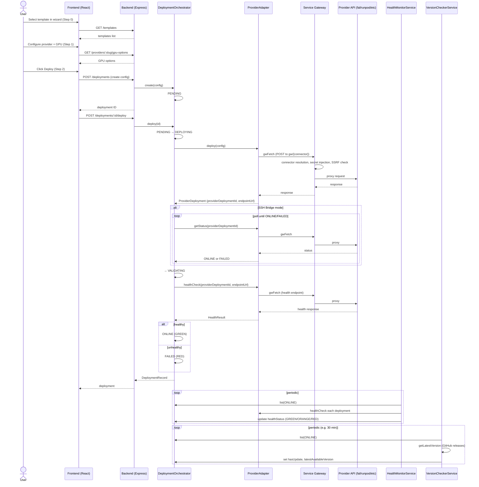
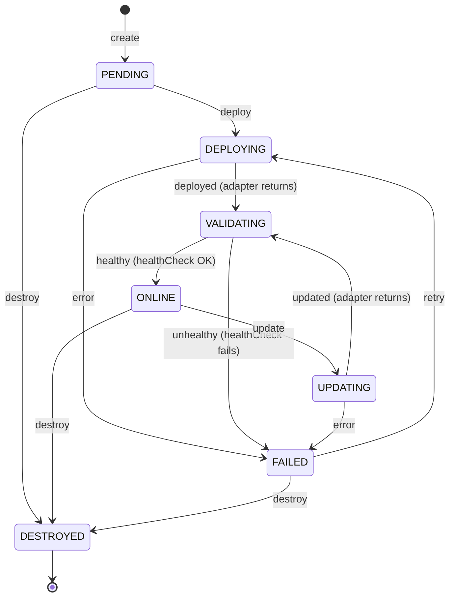

# Deployment Manager — Architecture Documentation

## 1. Plugin Architecture Diagram (ASCII art)

```
┌─────────────────────────────────────────────────────────────────────────────────────────┐
│                           DEPLOYMENT MANAGER PLUGIN                                        │
├─────────────────────────────────────────────────────────────────────────────────────────┤
│                                                                                           │
│  ┌─────────────────────────────────────────────────────────────────────────────────┐   │
│  │  FRONTEND (React SPA)                                                              │   │
│  │  • Dev: port 3117                                                                  │   │
│  │  • Prod: CDN bundle at /cdn/plugins/deployment-manager/                            │   │
│  │                                                                                    │   │
│  │  Pages: DeploymentWizard (3-step), DeploymentList, DeploymentDetail,               │   │
│  │         ProviderSettings, AuditPage                                                │   │
│  │                                                                                    │   │
│  │  Components: TemplateSelector, ProviderSelector, GpuConfigForm, SshHostConfig,   │   │
│  │              HealthIndicator, VersionBadge, DeploymentLogs, StatusTimeline,       │   │
│  │              AuditTable, ArtifactSelector                                          │   │
│  │                                                                                    │   │
│  │  Hooks: useDeployments, useProviders, useGpuOptions, useHealthPolling              │   │
│  └──────────────────────────────────────────────────┬──────────────────────────────┘   │
│                                                       │                                 │
│                                                       │ HTTP /api/v1/deployment-manager │
│                                                       ▼                                 │
│  ┌─────────────────────────────────────────────────────────────────────────────────┐   │
│  │  BACKEND (Express.js, port 4117)                                                 │   │
│  │                                                                                    │   │
│  │  Routes: /providers, /deployments, /templates, /health, /audit                     │   │
│  │                                                                                    │   │
│  │  Services:                                                                         │   │
│  │  • DeploymentOrchestrator — state machine (PENDING→DEPLOYING→VALIDATING→ONLINE,   │   │
│  │    with UPDATING, FAILED, DESTROYED)                                              │   │
│  │  • ProviderAdapterRegistry — Strategy pattern for provider adapters               │   │
│  │  • TemplateRegistry — curated + custom templates                                   │   │
│  │  • HealthMonitorService — periodic health polling                                  │   │
│  │  • VersionCheckerService — GitHub releases polling                                │   │
│  │  • AuditService — action logging                                                   │   │
│  │  • RateLimiter — request throttling                                                │   │
│  │                                                                                    │   │
│  │  Adapters (IProviderAdapter):                                                      │   │
│  │  FalAdapter → gw/fal-ai | RunPodAdapter → gw/runpod-serverless |                   │   │
│  │  ReplicateAdapter → gw/replicate | BasetenAdapter → gw/baseten |                    │   │
│  │  ModalAdapter → gw/modal | SshBridgeAdapter → gw/ssh-bridge                         │   │
│  └──────────────────────────────────────────────────┬──────────────────────────────┘   │
│                                                       │                                 │
│                                                       │ gwFetch → /api/v1/gw/{connector}│
│                                                       ▼                                 │
│  ┌─────────────────────────────────────────────────────────────────────────────────┐   │
│  │  SERVICE GATEWAY (Next.js middleware, port 3000)                                  │   │
│  │  • Connector resolution                                                           │   │
│  │  • Secret injection (SecretVault)                                                 │   │
│  │  • SSRF protection (allowedHosts allowlist)                                       │   │
│  │  • Circuit breaker                                                                 │   │
│  │  • Proxy to upstream Provider APIs                                                │   │
│  └──────────────────────────────────────────────────┬──────────────────────────────┘   │
│                                                       │                                 │
│                                                       ▼                                 │
│  ┌─────────────────────────────────────────────────────────────────────────────────┐   │
│  │  DATABASE (PostgreSQL, schema: plugin_deployment_manager)                          │   │
│  │  • ServerlessDeployment — deployment records                                      │   │
│  │  • DmDeploymentStatusLog — status transition log                                  │   │
│  │  • DmDeploymentAuditLog — action audit trail                                      │   │
│  │  • DmDeploymentHealthLog — health check results                                    │   │
│  │  • DmProviderAuthConfig — provider auth configs                                     │   │
│  │  • DmDeploymentTemplate — deployment templates                                     │   │
│  │                                                                                    │   │
│  │  NOTE: Orchestrator currently uses in-memory Map; Prisma integration planned.     │   │
│  └─────────────────────────────────────────────────────────────────────────────────┘   │
│                                                                                           │
└─────────────────────────────────────────────────────────────────────────────────────────┘
```

## 2. Deployment Control Flow (Mermaid sequence diagram)



## 3. State Machine Diagram (Mermaid state diagram)



**Valid transitions (from code):**

| From      | To                                  |
|-----------|-------------------------------------|
| PENDING   | DEPLOYING, DESTROYED                |
| DEPLOYING | VALIDATING, FAILED                  |
| VALIDATING| ONLINE, FAILED                     |
| ONLINE    | UPDATING, DESTROYED                 |
| UPDATING  | VALIDATING, FAILED                  |
| FAILED    | DEPLOYING, DESTROYED                |
| DESTROYED | (terminal)                          |

## 4. Service Dependency Graph

```
                    ┌───────────────────────────────┐
                    │  ProviderAdapterRegistry      │
                    │  (Strategy pattern)           │
                    └───────────────┬───────────────┘
                                    │
            ┌───────────────────────┼───────────────────────┐
            │                       │                       │
            ▼                       ▼                       ▼
┌───────────────────────┐ ┌───────────────────────┐ ┌─────────────────────┐
│ DeploymentOrchestrator │ │ HealthMonitorService   │ │ Routes: /providers   │
│ (state machine)        │◄│ (periodic polling)     │ │ /providers/:slug/   │
└───────────┬───────────┘ └───────────┬───────────┘ │ gpu-options          │
            │                           │
            │  uses registry.get(slug)  │
            │  for healthCheck          │
            │                           │
            ├───────────────────────────┼───────────────────────────────────┐
            │                           │                                   │
            ▼                           ▼                                   ▼
┌───────────────────┐     ┌───────────────────┐               ┌───────────────────┐
│ AuditService       │     │ TemplateRegistry  │               │ Routes:            │
│ (action log)       │     │ (curated+custom)  │               │ /deployments       │
└───────────────────┘     └─────────┬─────────┘               │ /templates         │
                                    │                          │ /health            │
                                    │                          │ /audit             │
                                    ▼                          └───────────────────┘
                        ┌───────────────────────┐
                        │ VersionCheckerService │
                        │ (GitHub releases)     │
                        └───────────┬───────────┘
                                    │
                                    │ depends on: orchestrator, templateRegistry
                        ┌───────────┴───────────┐
                        │ GithubReleasesAdapter │
                        │ → gw/github-releases  │
                        └───────────────────────┘
```

**Dependency summary:**

| Service                 | Depends on                                              |
|-------------------------|---------------------------------------------------------|
| DeploymentOrchestrator  | ProviderAdapterRegistry, AuditService                   |
| HealthMonitorService    | ProviderAdapterRegistry, DeploymentOrchestrator         |
| VersionCheckerService   | DeploymentOrchestrator, TemplateRegistry                |
| TemplateRegistry        | GithubReleasesAdapter (internal)                         |
| AuditService            | (none — standalone)                                     |
| RateLimiter             | (none — used by deployments router)                    |
| Routes /deployments     | DeploymentOrchestrator, RateLimiter                     |
| Routes /providers       | ProviderAdapterRegistry                                 |
| Routes /templates       | TemplateRegistry                                        |
| Routes /health          | HealthMonitorService, DeploymentOrchestrator             |
| Routes /audit           | AuditService                                            |
